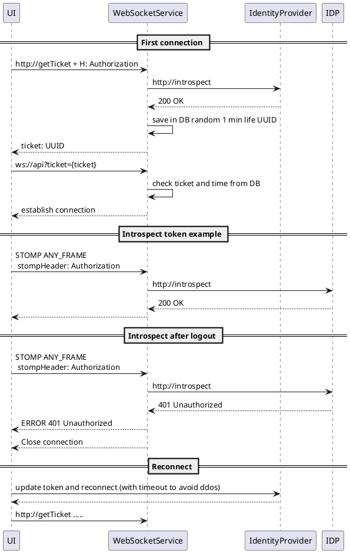

* pluntuml - https://plantuml.com/ru/sequence-diagram
* stomp-protocol for MQ - https://stomp.github.io/stomp-specification-1.2.html
* ws security - WS Stomp Security

* mjs
* nodaemon
* express
* stomp-broker-js - https://www.npmjs.com/package/stomp-broker-js
* middleware - Add in stompServer.js new line - https://github.com/4ib3r/StompBrokerJS/pull/34/commits/702ce52624112fcde967b52ca185c0e0098f72ee
* node debug

* module - ``
* stomp - https://github.com/stomp-js/stompjs (https://www.npmjs.com/package/@stomp/stompjs not an old one https://www.npmjs.com/package/stompjs)
* reconnect
